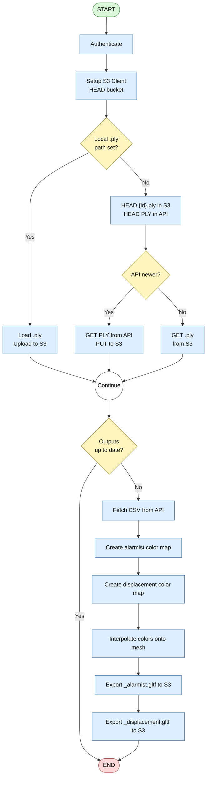
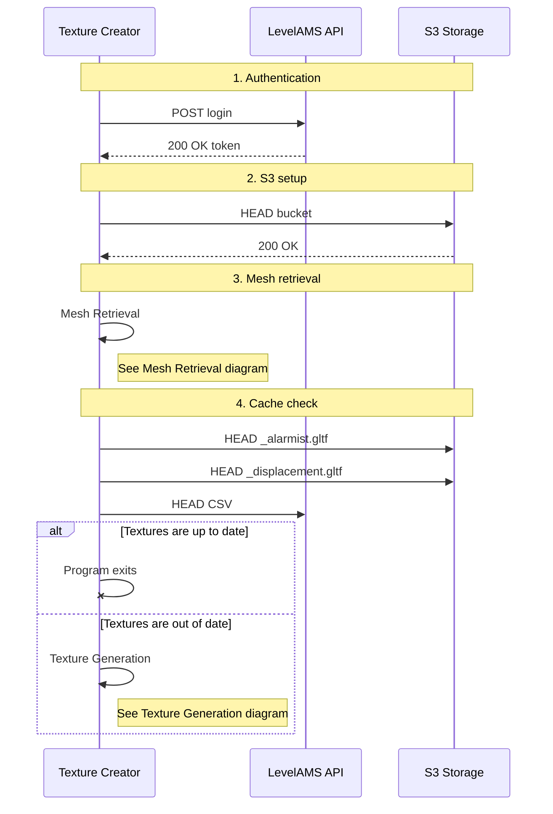
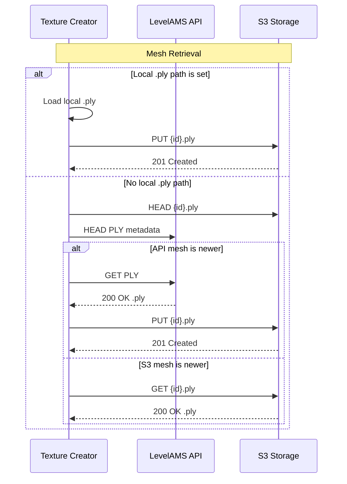
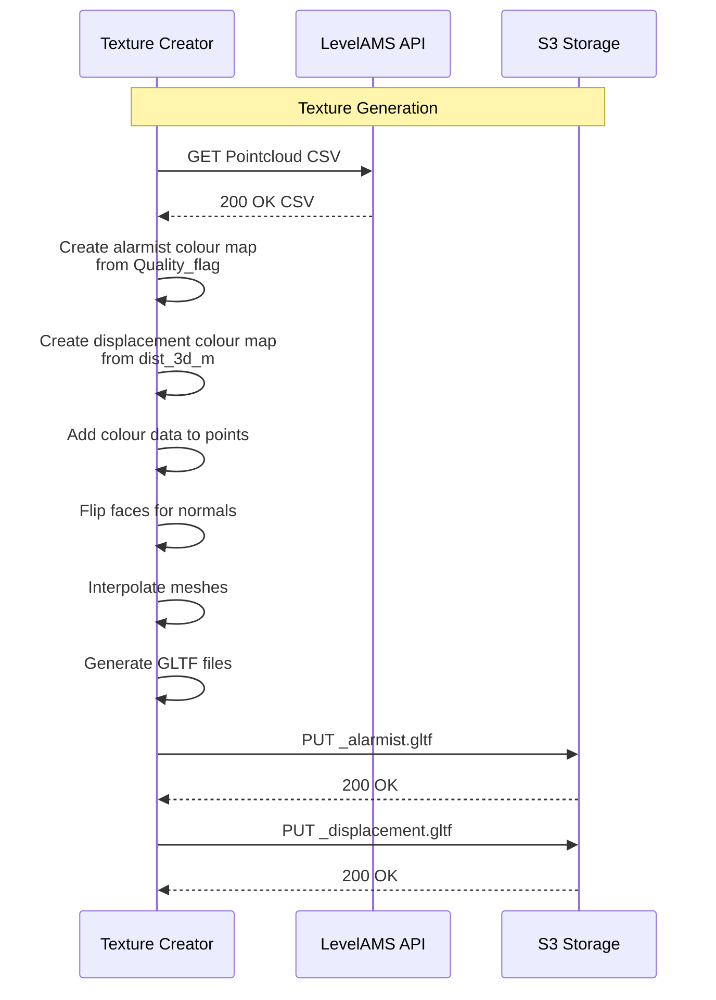
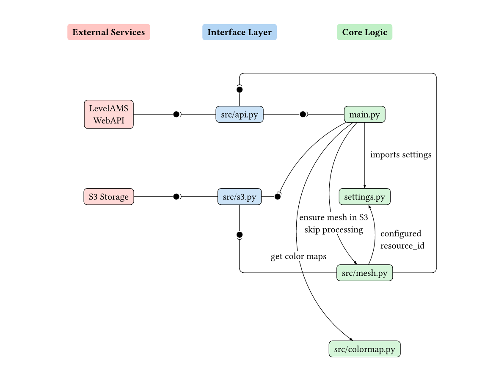
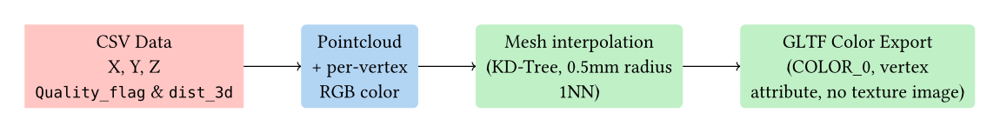

# Program's execution and main logic

The main program, as implemented currently, will behave as follows:



In addition, the sequence diagram of the main execution flow is as follows:







# Code Structure

The program is logically structured as follows:



> **_NOTE_**: For ease of understanding this diagram: This uses a `ball and
> socket` notation, where a ball represents providing an interface, and a socket
> represents consuming said interface. It is used to show the dependencies
> between internal components of the system (and interaction with external
> systems). The `App Core` column consists of `main.py` and `settings.py`. The
> `Pipeline Modules` column consists of the files within `src/` and the
> `External Systems` column consists of the systems that are interacted with.
> For ease of understanding, the data models were included within their
> respective modules.

In `main.py` the sequential pipeline is orchestrated, importing functions from
each of the modules in `src/`. The configuration is loaded from a global
`settings` singleton defined in `settings.py`, which is consumed by every
downstream module.

# Data Models

The data models in this project are all created using `Pydantic`'s `BaseModel`
and `BaseSettings` for configuration management. To see more about how to
create a `Pydantic` model, consultation of their [official
documentation](https://pydantic.dev/docs/validation/2.11/get-started/) is
recommended. However, the important concepts are that a new class has to be
created that extends the `BaseModel` class, and fields are defined within this
new class, along with their types. `Pydantic` is then responsible for the
serialization and deserialization of the model.

In `settings.py`, the configuration models are structured as a tree of
`BaseModel` subclasses, aggregated into a top-level `Settings(BaseSettings)`
class:

- **`ApiSettings`** holds the `base_url` field (`AnyHttpUrl`) for the API
  endpoint that serves point cloud and mesh data.
- **`AuthSettings`** holds `tenant`, `resource_id`, `username`, and `password`
  for authenticating with the API.
- **`S3Settings`** holds `endpoint`, `access_key`, `secret_key`, and `bucket`
  for the S3-compatible storage.
- **`MeshSettings`** holds an optional `path` field for loading a local PLY
  mesh directly.

The `Settings` class uses `pydantic-settings` to load from multiple sources in
priority order:

```python
class Settings(BaseSettings):
    model_config = SettingsConfigDict(
        toml_file="config.toml",
        env_file=".env",
        env_nested_delimiter="__",
        extra="ignore",
    )

    s3: S3Settings = S3Settings()
    api: ApiSettings = ApiSettings()
    auth: AuthSettings = AuthSettings()
    mesh: MeshSettings = MeshSettings()
```

The source resolution order is `config.toml` (lowest), then `.env` (medium),
then environment variables (highest). Nested fields use `__` as a delimiter
(e.g. `S3__BUCKET`). A single global instance is created at module level:

```python
settings = Settings()
```

Additionally, in `src/api.py`, two transient models are defined for the
authentication handshake:

- **`AuthRequest`** — a `BaseModel` with `username` and `password` fields,
  serialised as JSON in the POST body.
- **`AuthResponse`** — a `BaseModel` with a `token` field, deserialised from the
  API's JSON response.

For a matter of organization, it is expected that any new models are created
alongside the module they belong to, with a name that allows for ease of
recognition of the model's purpose.

# API Interface

The API interface (`src/api.py`) is responsible for all HTTP interactions with
the upstream data provider, this being the LevelAMS API.
It exposes the following public functions:

- **`fetch_token() -> str`** — authenticates against
  `{base_url}/{tenant}/api/accounts/login` with a POST request containing the
  configured credentials. Returns a bearer token used for all subsequent calls.

- **`fetch_polygon(token: str) -> bytes`** — downloads the PLY mesh from
  `{base_url}/{tenant}/api/v1/activos-geotecnicos/{resource_id}/modelo/{POLYGON_TYPE}/download`.
  Returns the raw bytes of the file.

- **`fetch_csv(token: str) -> pd.DataFrame`** — fetches the point-cloud CSV
  from the same URL pattern with `{CSV_TYPE}` substituted, and parses it into a
  Pandas DataFrame.

- **`_get_api_last_modified(url: str, token: str) -> datetime | None`** — issues
  a `HEAD` request to the given API URL and extracts the `Last-Modified` header.
  Used by the cache-check logic to compare source freshness against S3 outputs.

Internal URL builders (`polygon_url()`, `csv_url()`, `_auth_url()`) construct
the API endpoints from the settings singleton. The URL constants are:

```python
POINT_CLOUD_TYPE = "ActivoGeotecnicoModeloModelType_CSV_Point_Cloud"
POLYGON_TYPE = "ActivoGeotecnicoModeloModelType_Ply"
```

All HTTP calls use the `httpx` library. Error handling is limited to raising
`httpx.HTTPError` on non-2xx responses via `raise_for_status()`.

# S3 Interface

The S3 interface (`src/s3.py`) is responsible for all interactions with the
S3-compatible storage used for caching both the input PLY mesh and the output
GLTF files. It exposes the following public functions:

- **`build_s3_client() -> BaseClient`** — constructs a `boto3.client("s3", ...)`
  from the configured endpoint, access key, and secret key. Exits with an error
  if the required fields are missing.

- **`get_s3_client() -> tuple[BaseClient, str]`** — wraps `build_s3_client()` and
  performs a bucket existence check via `head_bucket()`. Returns the client and
  bucket name. Logs a warning if the bucket is inaccessible but does not halt
  execution.

- **`download_from_s3(client, bucket, object_key, download_path)`** — downloads
  an S3 object to a local file. Raises `botocore.exceptions.ClientError` on
  failure.

- **`upload_to_s3(client, file_path, bucket, object_key)`** — uploads a local
  file to S3 via `upload_file`.

- **`upload_bytes_to_s3(client, data, bucket, object_key)`** — uploads raw bytes
  to S3 via `put_object`.

- **`_get_s3_last_modified(client, bucket, object_key) -> datetime | None`** —
  issues a `HEAD` request to the S3 object and returns its `LastModified`
  timestamp. Returns `None` if the object does not exist (404). Used by the
  cache-check logic.

# Mesh Processing

The mesh processing module (`src/mesh.py`) is responsible for resolving the
input PLY mesh from one of three sources — local file, API download, or S3
cache — and for deciding whether the pipeline can be skipped entirely.

**`ensure_mesh_in_s3(s3_client, bucket, token, mesh_path) -> pv.DataObject`**

This function implements a three-tier priority chain:

1. **Local file** — If `mesh_path` is not `None`, the mesh is loaded directly
   from the local filesystem via `pv.read()`, uploaded to S3 as
   `{resource_id}.ply`, and returned immediately. Both API and S3 fallback are
   bypassed.

2. **API fetch** — If no local path is set, the function compares the
   `Last-Modified` timestamp of the cached PLY in S3 against the API's polygon
   endpoint. If S3 has no cached copy, or the API has a newer version, the mesh
   is downloaded from the API via `fetch_polygon()`, uploaded to S3 via
   `upload_bytes_to_s3()`, and returned.

3. **S3 fallback** — If the API is unreachable but a cached PLY exists in S3
   (the S3 timestamp was not `None` before the attempt), the stale copy is
   downloaded and used. If neither source is available, a `FileNotFoundError`
   is raised and the program exits.

```python
need_api_fetch = s3_ply_lm is None or (
    polygon_api_lm is not None and polygon_api_lm > s3_ply_lm
)
```

**`should_skip_processing(s3_client, bucket, token) -> bool`**

This function provides idempotency. It compares the oldest of the two output
`.gltf` files in S3 against the API's CSV `Last-Modified` header:

```python
alarmist_lm = _get_s3_last_modified(s3_client, bucket, alarmist_key)
displacement_lm = _get_s3_last_modified(s3_client, bucket, displacement_key)
s3_lastmodified = min(alarmist_lm, displacement_lm)
api_last_modified = _get_api_last_modified(csv_url(), token)
if s3_lastmodified >= api_last_modified:
    return True  # skip processing
```

The function returns `False` (i.e., proceed with processing) if either output
file is missing from S3 or if the API's `Last-Modified` cannot be determined.

Both functions rely on `_get_s3_last_modified()` and
`_get_api_last_modified()`, internal helpers that issue HTTP `HEAD` requests
to the S3 object and the API URL respectively, returning `datetime` objects or
`None`.

# Color Computation

The color computation module (`src/colormap.py`) provides two independent
mapping functions from point-cloud data to vertex colors, one for each of the
two output textures.

**`get_color(flag: str) -> list[float]`**

Maps the `Quality_flag` column of the CSV to a fixed RGB color:

| Flag | Color | RGB |
|------|-------|-----|
| `alert` | Yellow | `[1.0, 1.0, 0.0]` |
| `alarm` | Red | `[1.0, 0.0, 0.0]` |
| `OK` (default) | Green | `[0.0, 1.0, 0.0]` |

The input string is lowered and stripped before matching; any unrecognized
value defaults to green. The lookup is a simple `if-elif-else` chain.

**`compute_displacement_colors(dist_series: pd.Series) -> np.ndarray`**

Maps the `dist_3d_m` field through a signed color gradient:

1. **Missing values** are filled with `0.0` (green, no displacement).
2. The array is **clamped** to the ±20 mm range via `np.clip(dist, -0.02, 0.02)`.
3. Negative and positive displacements are handled separately:
   - **Negative** ([20 mm, 0 mm]): interpolates linearly from pink
     `[1.0, 0.0, 1.0]` at −20 mm to green `[0.0, 1.0, 0.0]` at 0 mm.
   - **Positive** ([0 mm, +20 mm]): interpolates linearly from green
     `[0.0, 1.0, 0.0]` at 0 mm to red `[1.0, 0.0, 0.0]` at +20 mm.
   - Zero-valued entries remain green.

The interpolation is a simple linear ramp per color channel:

```python
# Negative branch
t_neg = (d_neg + 0.02) / 0.02       # 0 at -20mm, 1 at 0mm
colors[neg_mask, 0] = 1.0 - t_neg   # R: 1 → 0
colors[neg_mask, 1] = t_neg         # G: 0 → 1
colors[neg_mask, 2] = 1.0 - t_neg   # B: 1 → 0

# Positive branch
t_pos = d_pos / 0.02                 # 0 at 0mm, 1 at +20mm
colors[pos_mask, 0] = t_pos          # R: 0 → 1
colors[pos_mask, 1] = 1.0 - t_pos    # G: 1 → 0
colors[pos_mask, 2] = 0.0            # B: stays 0
```

The function returns a NumPy array of shape `(N, 3)` with _dtype_ `float64`.

# Vertex Color Pipeline

The following section details how the per-point colors produced by `colormap.py`
are transferred onto the mesh surface and exported as a GLTF file.

## From Colored Points to Textured Mesh

### 1. Points receive colors

In `main.py`, after fetching the CSV, the color arrays are computed in
parallel:

```python
csv_colors = np.array([get_color(f) for f in df["Quality_flag"]])
cloud = pv.PolyData(df[["X", "Y", "Z"]].values)
cloud.point_data["Colors"] = csv_colors

disp_colors = compute_displacement_colors(df["dist_3d_m"])
disp_cloud = pv.PolyData(df[["X", "Y", "Z"]].values)
disp_cloud.point_data["Colors"] = disp_colors
```

Two independent `pyvista.PolyData` point clouds are created — one for the
alarmist texture (based on `Quality_flag`) and one for the displacement texture
(based on `dist_3d_m`). At this stage, the colors live **only on the sparse
point cloud** (typically thousands of points), while the mesh has its own
vertices (typically tens of thousands) with no color data.

### 2. Colors are interpolated onto mesh vertices

```python
mesh.flip_faces(inplace=True)
interpolated = mesh.interpolate(cloud, n_points=1, radius=0.5)
interpolated.set_active_scalars("Colors")
```

Under the hood, `pyvista.DataSetFilters.interpolate()` performs the following:

1. Builds a **KD-tree** from the point cloud's spatial coordinates.
2. For **each vertex** of the mesh, finds the single nearest colored point
   within the 0.5 m search radius (`n_points=1, radius=0.5`).
3. Copies that point's RGB value into the corresponding mesh vertex's `Colors`
   array.
4. Vertices with **no neighbor within 0.5 m** receive a `NaN` value and will
   appear black or uncolored in the output.

The result is a **new mesh** with identical geometry but now carrying per-vertex
colours. The `mesh.flip_faces()` call ensures the winding order is correct for
the downstream GLTF renderer.

> **_NOTE:_** This is **not** a UV texture map. There is no image, no UV
> coordinates, and no texture atlas. The colors are embedded directly as an
> attribute of each mesh vertex.

### 3. Meshes are exported to GLTF

```python
pl = pv.Plotter(off_screen=True)
pl.add_mesh(interpolated, scalars="Colors", rgb=True, preference="point")
pl.export_gltf(tmp_path)
```

PyVista's GLTF exporter writes the mesh geometry and maps the active `Colors`
array to the **`COLOR_0` vertex attribute** in the GLTF file. Per the GLTF
specification:

- The `.gltf` file contains **no image data** — only vertex attribute arrays.
- Rendering is done via **vertex color interpolation**: the GPU interpolates
  colors across triangle fragments using the three colored vertices of each
  face.
- Any GLTF-compatible viewer (Babylon.js, Three.js, Windows 3D Viewer) loads
  `COLOR_0` and maps it to the material's `vertexColors` property, rendering
  the mesh as if it has a painted surface.



The two output files are uploaded to S3 as `{resource_id}_alarmist.gltf` and
`{resource_id}_displacement.gltf`.

# Main Pipeline

As orchestrated by `main.py`, the sequential pipeline proceeds as follows:

1. **Authentication** — `fetch_token()` is called to obtain a bearer token from
   the API's login endpoint.

2. **S3 client initialization** — `get_s3_client()` builds a `boto3` client and
   verifies that the configured bucket is accessible.

3. **Mesh retrieval** — `ensure_mesh_in_s3()` resolves the input PLY from the
   local file system, the API, or the S3 cache, returning a `pyvista.PolyData`.

4. **Cache check** — `should_skip_processing()` compares the S3 output
   timestamps against the API's CSV `Last-Modified`. If the outputs are
   up-to-date, the program exits early.

5. **CSV data fetch** — `fetch_csv()` downloads the point-cloud CSV and parses
   it into a Pandas `DataFrame`.

6. **Color computation** — Two color arrays are computed in parallel:
   `get_color()` for each `Quality_flag` value, and
   `compute_displacement_colors()` for the `dist_3d_m` column.

7. **Interpolation** — Each color array is assigned to a `pyvista.PolyData`
   point cloud. The mesh is face-flipped, then each point cloud is interpolated
   onto the mesh using `interpolate(n_points=1, radius=0.5)`.

8. **GLTF export** — Each interpolated mesh is written to a temporary GLTF file
   via `pyvista.Plotter.export_gltf()`, then uploaded to S3 as
   `{resource_id}_alarmist.gltf` and `{resource_id}_displacement.gltf`.
